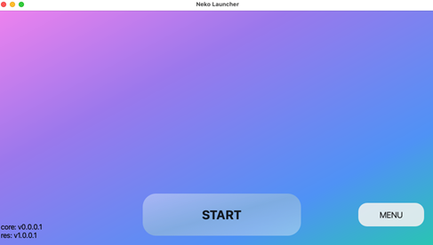

# dev branches

This branch applies to unfinished development, and it may fail to build successfully.

## Neko Launcher

Nekolc (Neko launcher or NeLc) is a modern, customizable cross-platform launcher program framework. It aims to lower the software usage barrier, making it user-friendly and straightforward to operate.  
It can launch any object, wrapping around anything, and includes self-updating and automatic software content updates.  
This is also my first project learning C++ for nearly a year.  
The project is still in development, and any constructive ideas are welcome.  
Preview :  


## Become Contributors

Since I am not very familiar with the UI, I would greatly appreciate any interest in this area.

Currently, the following aspects are still incomplete:

- **UI**: Transition animations, theme settings/style customization.
- **Others**: Internationalization (translations), more template examples, and optimization of CMake files.

Of course, I would be very grateful for any help you can provide or any ideas to make the project more robust. If you are interested, feel free to submit issues.

## Supported Platforms

We use Qt6 to build the GUI. Its minimum requirements are:

- Windows 10 (H1809) x86_64
- macOS 11 x86_64, x86_64h, and arm64
- Linux (Ubuntu 20.04, OpenSuSE 15.4) x86_64

Our main program also uses cross-platform methods, making it supported on most platforms.  
In other words, if you change the GUI version or framework, it might support other platforms as well, more or less.
You can also forgo the GUI; its core should still run properly.

## Build

prerequisites:  
std >= c++20  
qt6  
cmake  
libcurl  
openssl  

Already included in the project dependencies:  

simpleIni  
nlohmann/json  
loguru  
threadpool  

After satisfying the prerequisites, continue:

```shell
git clone https://github.com/moehoshio/NekoLauncher.git
cd NekoLauncher && mkdir build
cp CmakeListsCopy.txt CmakeLists.txt
# Customize your configuration, including the include and library directories. Then continue:
cd build
cmake ..
cmake --build ./ --config Release
#or
cmake -DCMAKE_BUILD_TYPE=Release ..
cmake --build ./
```

You can also configure the Qt path and include directories using command-line parameters:  

```shell
cmake .. -DCMAKE_PREFIX_PATH="QtPath" -DQtBin="QtPath+/bin" -DINCLUDE_DIRS="includePaths ; QtPath+/include" -DLIBRARY_DIRS="libPath e.g libcurl path..."
```

However, it’s still more intuitive to edit the CMake files.  
You only need to edit the mentioned parts.

Custom include and library path in CMakeList.txt :  
INCLUDE_DIRS  
LIBRARY_DIRS  
e.g

```cmake
list(APPEND INCLUDE_DIRS
    ${CMAKE_SOURCE_DIR}/src/include
    /to/path/include
)
list(APPEND LIBRARY_DIRS
    /to/path/libs
)
```

CMAKE_PREFIX_PATH : qt path e.g  /user/home/qt/6.6.0  
QtBin : qt bin path  e.g /user/home/qt/6.6.0/bin  

If you want to use this project, you'll actually need to customize some objects. This is necessary because everyone's goals and the resources they need to manage are different.  
In short, you need to customize your logic within the `launcher` function in the `src/include/core.h` file, as well as modify the contents in `src/data/`.

After completing these steps, you'll need to deploy your server. A simple example can be found at:  
[server.md](doc/server.md).

### Contribution and Customization

[dev.md](doc/dev.md)
