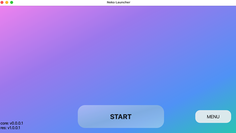

# Neko Launcher

[繁體中文](readme_zh_hant.md) | [简体中文](readme_zh_hans.md) | [English](readme.md)  
Neko Launcher (NekoLc) 是一个现代化、跨平台、多语言支持的自动更新启动器解决方案。  
它可以启动你想要的任何目标，目前的模板已经可以成功启动 Java 版 Minecraft。  
它包含自动内容更新与自我更新（无论是你的内容还是 Neko Core 本身），也支持自动安装你的内容。  
如果你还在寻找自动更新方案，或是被自动化更新困扰（用户不会操作、缺乏自动化更新管理方案……），那么可以试试这个。  
本项目仍在开发中，欢迎任何建设性的想法。  
预览：  
  
gif:  
  

## 欢迎成为贡献者

目前尚有以下部分尚未完善：

- **UI**：转场动画、主题设置/样式自定义，以及更好的美术设计。

- **其他**：更多模板示例，考虑拖拽机制以可视化自定义界面，甚至可能加入音乐播放功能？

当然，非常感谢你能提供任何协助或想法让项目更加完善。如果你有兴趣，欢迎提交 issue。

## 支持平台

我使用 Qt6 构建 GUI，但其实并未使用任何特殊 API。  
你应该也可以用 Qt5 来构建：  
Ubuntu 18.04  
macOS 10.13  
Windows 7  

主程序也采用跨平台方式实现，因此大多数平台都能支持。  
换句话说，你也可以不用 GUI，核心依然能正常运行。

## 构建方式

先决条件：  
std >= c++20  
Qt5.6.0 ?（6.6 与 6.8 为测试版本）  
cmake 3.20 以上（3.29 为测试版本）  
libcurl 8.1 为测试版本  
openssl 3.4 为测试版本  
boost.process 1.86.0 为测试版本  

项目已内建以下依赖库：  

simpleIni 4.20  
nlohmann/json 3.11.3  
loguru 2.1  
threadpool for 2021-3507796

满足先决条件后，请继续：

```shell
git clone https://github.com/moehoshio/NekoLauncher.git && cd NekoLauncher

# Unix
chmod +x ./build.sh && ./build.sh

# Windows
build.bat

# 或手动构建

cp CmakeListsCopy.txt CmakeLists.txt

# 填写你的路径
cmake . -B./build -DCMAKE_PREFIX_PATH="qt 路径与包" -DLIBRARY_DIRS="包路径(可选)" -DQt6="qt 路径(可选)" -DCMAKE_BUILD_TYPE="Debug 或 Release (可选)"

cmake --build ./build --config Release
```

此外，工作目录还需要包含以下文件：  
必须有的文件夹：lang/、img/  
必须有的文件：config.ini、cacert.pem、img/loading.gif、img/ico.png、lang/en.json。（这不包括你的动态链接库）

### 贡献与自定义

如果你想使用本项目，可能需要根据需求进行修改，因为它高度自定义化。  

如果你只是想让内容自动更新，其实不会太困难。

使用我们提供的模板方法：修改 `src/include/neko/schema/nekodefine.hpp` 最上方的 `launcherMode` 变量。  

目前已提供 Minecraft Java 的模板，将变量改为 `"minecraft"` 即可。  

如果你想要完全自定义逻辑：可以在任何地方写你的函数，然后在 `src/include/neko/core/launcher.hpp` 的 `launcher` 函数中调用它。  

你可能还需要编辑 `src/include/neko/schema/nekodefine.hpp` 里的版本号与服务器链接。  

例如，如果你想启动 `example.exe`：

```cpp
inline void launcher(std::function<void(const ui::hintMsg &)> hintFunc,std::function<void()> onStart, std::function<void(int)> onExit) {
    // 写下你的内容

    // shell: example.exe -args ...
    std::string command = std::string("example.exe ") + "-你可能需要一些参数 " + "args...";
    launcherProcess(command,onStart,onExit);
}
```

更多详细信息请参考：  
[dev.md](doc/dev.md)

完成上述步骤后，你还需要部署你的服务器。简单示例可参考：  
[server.md](doc/server.md)。
