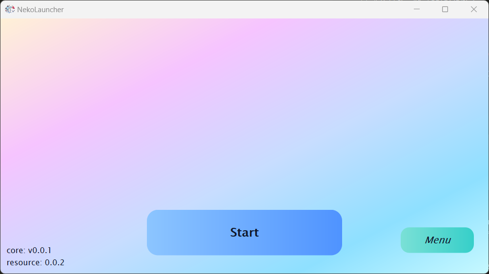
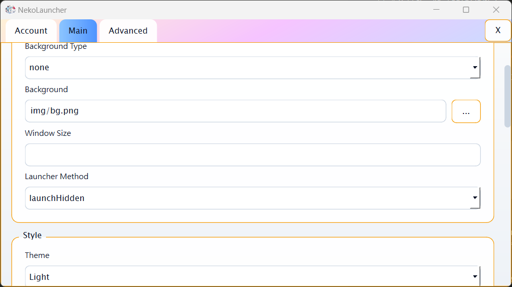

# Neko Launcher

[正體中文](readme_zh_hant.md) | [简体中文](readme_zh_hans.md) | [English](readme.md)  

Neko Launcher（NekoLc）是一個現代化、跨平台、多語言的啟動器，內建自動更新機制。它能啟動任意目標；目前模板預設支援 Minecraft Java 版。啟動器可同時更新你的內容與 Neko Core，本身也能自動安裝資源，並提供可自訂的 UI。

預覽：  
  
  

## 功能

- 啟動器與發佈內容的自動更新流程
- 跨平台 Qt 介面，支援主題、字型與語言自訂
- 內建 Minecraft Java 版啟動模板，可擴充至其他目標
- 內建通知、輸入、進度/載入顯示等對話框

## 系統需求

- CMake 3.20+、C++20 編譯器（MSVC/Clang/GCC）
- Qt 6（Widgets + Gui + Core）；Qt 5.15+ 可能可用但未充分測試
- Git（含子模組）與可存取網路以在設定時抓取依賴

## 快速開始（桌面）

```powershell
# Clone
git clone https://github.com/moehoshio/NekoLauncher.git
cd NekoLauncher

# Configure
cmake -B build -DNEKO_LC_LIBRARY_PATH="<Qt_path>;<Package_path>" -DNEKO_LC_STATIC_LINK=ON -S .

# Build (Debug|Release)
cmake --build build --config Release

# Run
./build/Release/NekoLc.exe
```

若使用其他工具鏈，請替換合適的產生器/指令。若未自動找到 Qt，請設定 `NEKO_LC_LIBRARY_PATH`。

## 設定

- `config.ini.example` 展示可用項目；複製為 `config.ini` 後調整路徑、背景與更新端點。
- 語言檔位於 `lang/`；圖像資源位於 `resource/img/`。

## 貢獻

- 模板：擴充至更多啟動目標（不只 Minecraft）
- 體驗：拖放式版面自訂、選用的音樂播放、更多測試

歡迎提交 issue 或 PR，開發筆記請見 `doc/dev.md`。

## 文件

- 開發者指南： [doc/dev.md](doc/dev.md)
- 伺服端專案： [NekoLcServer](https://github.com/moehoshio/NekoLcServer)
